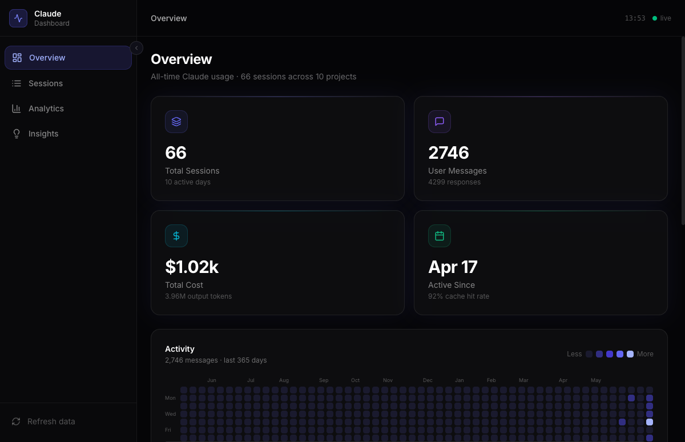

# Claude Dashboard

A premium, open-source local analytics dashboard for [Claude Code](https://claude.ai/code). Visualises your real usage data — token costs, session history, activity patterns, tool usage, and AI-generated insights — directly from your `~/.claude/` directory.

**All data stays 100% local. No external APIs. No telemetry.**



## Features

- **Overview** — Hero stats (sessions, messages, exact cost, active days), GitHub-style activity heatmap, hourly usage chart, top projects, model breakdown
- **Sessions** — Full table of all sessions with search, sort, and pagination. Click any session to explore the full conversation
- **Session Detail** — Conversation timeline with per-message token spend bars, tool call cards, and a meta panel showing cost breakdown, git branch, and skills used
- **Analytics** — Token usage over time (stacked area chart), tool usage breakdown, prompt cache efficiency gauge, cost by project
- **Insights** — Peak coding hours, activity streaks, cache savings ($$$), tool frequency, experiments & features used

## How it works

Claude Code writes detailed JSONL files to `~/.claude/projects/` for every session. Each `assistant` message includes the full Anthropic API `usage` object with real token counts. This dashboard parses those files, computes exact costs using current model pricing, and serves a React frontend.

```
~/.claude/projects/{project-path}/{session-uuid}.jsonl
  → sessionParser.ts
  → costCalculator.ts (exact pricing per model)
  → Express API
  → React + Recharts + Framer Motion
```

## Quick start

**Prerequisites:** Node.js 20+, Claude Code installed (so `~/.claude/` exists)

```bash
git clone https://github.com/yourusername/my-claude-dashboard
cd my-claude-dashboard
cp .env.example .env
npm install
npm run dev
```

Open **http://localhost:5173**

> The server (port 3001) parses your `~/.claude/` on first request and caches for 60 seconds. Use **Refresh data** in the sidebar to re-parse.

## Configuration

Edit `.env` (copy from `.env.example`):

```env
# Path to your Claude Code data directory
CLAUDE_DIR=~/.claude

# Server port
PORT=3001

# Cache TTL in seconds
CACHE_TTL_SECONDS=60
```

If your Claude data is at a custom path (e.g. you use multiple profiles), set `CLAUDE_DIR` accordingly.

## Tech stack

| Layer      | Tech                                           |
| ---------- | ---------------------------------------------- |
| Frontend   | React 19 + TypeScript + Vite + React Router v7 |
| Styling    | Tailwind CSS v4 + custom dark design system    |
| State      | Zustand + TanStack Query v5                    |
| Charts     | Recharts                                       |
| Animations | Framer Motion                                  |
| Backend    | Node.js + Express + TypeScript                 |
| Data       | Reads `~/.claude/` JSONL files directly        |

## Model pricing

Cost calculations use these rates (USD per million tokens):

| Model             | Input | Output | Cache write | Cache read |
| ----------------- | ----- | ------ | ----------- | ---------- |
| claude-opus-4-7   | $15   | $75    | $18.75      | $1.50      |
| claude-sonnet-4-6 | $3    | $15    | $3.75       | $0.30      |
| claude-haiku-4-5  | $0.80 | $4     | $1.00       | $0.08      |

Update `server/src/config.ts` → `MODEL_PRICING` when Anthropic publishes new pricing.

## Enriching sessions with checkpoints

The dashboard reads whatever is already in `~/.claude/`. To get richer session summaries (goal, outcome, experiments used), add this to your global `~/.claude/CLAUDE.md`:

```markdown
## Session Checkpoint Protocol

At natural pause points in long sessions (after completing a feature, ~30 messages),
write a brief checkpoint comment in the conversation:

<!-- checkpoint: [what was accomplished], state: [in-progress|blocked|done] -->

## Session Experiments Tracking

When trying a new Claude feature (extended thinking, multi-agent, a new skill, MCP tool),
mention it explicitly so it appears in the session's skills/features panel.
```

For automated session summaries on every session end, add a Stop hook to `~/.claude/settings.json` that writes a JSON summary to `~/.claude/analytics/checkpoints/`.

## Privacy

- Reads `~/.claude/` in **read-only** mode — no writes to your data directory
- No network requests from the server other than serving the local frontend
- The `.gitignore` excludes `*.jsonl` and `.env` — your session data never ends up in git

## Development

```bash
npm run dev:server    # Express on :3001 only
npm run dev:client    # Vite on :5173 only
npm run dev           # Both concurrently
npm run typecheck     # TypeScript check (client + server)
```

## Contributing

PRs welcome. If you add new model pricing, improve the insights engine, or add new chart types — please open a PR. Keep the "all data stays local" principle.

## License

MIT — use it, fork it, blog about it.

---

Built with Claude Code · [Claude Dashboard on GitHub](https://github.com/yourusername/my-claude-dashboard)
